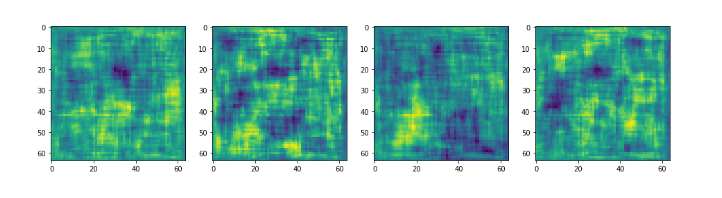
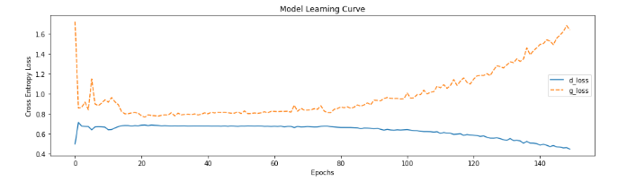
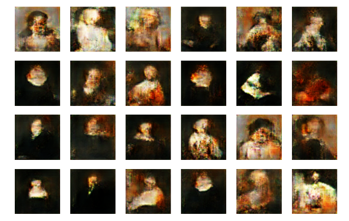

  
  <h1>ArtGAN</h1>

This project utilizes a GAN architecture, consisting of a generator and a discriminator, to generate synthetic art. The generator creates new images, while the discriminator evaluates the authenticity of these images. Through an adversarial training process, the two networks compete against each other, leading to the generation of 64 by 64 art pieces.

## Roadmap

- [x]  Research GAN architectures
- [x]  Set up data pipeline
- [x]  Implement generator
- [x]  Develop discriminator
- [x]  Create custom training loop
- [x]  Fine-tune training process (i.e., learning rates, random noise injection, binary cross entropy)
- [x]  Optimise GAN’s architecture (i.e., neural network structures and hyperparameters)
- [x]  Evaluate generated images
- [x]  Identify areas for further improvement

## Stack

- TensorFlow
- Generative Adversarial Network (GAN)
- Convolutional Neural Network (CNN)
- Adam Optimizer
- Binary Cross Entropy
- Random Noise Injection
- Data pipeline and Custom training loop

## Data Overview

- [Art Portraits - Karnika Kapoor](https://www.kaggle.com/datasets/karnikakapoor/art-portraits)

## Architecture

### Generator

The architecture is based on the findings and guidelines proposed in the paper:

- Replace any pooling layers with strided convolutions (discriminator) and fractional-strided convolutions (generator)
- Use batchnorm in both the generator and the discriminator
- Remove fully connected hidden layers for deeper architectures
- Use ReLU activation in the generator
- Use LeakyReLU activation in the discriminator for all layers

### Discriminator

The discriminator is simply a CNN-based image classifier (real or fake).

  

  _Figure 1: Visualising generated images without training._

## Training loop

The training of GANs is notoriously difficult since the balance between the speed at which the discriminator trains and the speed at which the generator can learn. One way to accomplish this is by injecting random noise into the output from the discriminator, to trick it and slow down a bit.

Typically, when a DNN needs to be trained there are some key steps:

- Instantiate the model
  - Create the model
  - Compile the model (which assigns a loss function and an optimiser)
  - Fit the model (which trains the model)

Since GANNs have two components (generator and discriminator), we need to train them side by side, so we can't just use model.fit. In other words, we need to define our custom training loop and what the .fit function does.

We will use the Adam optimizer and the Binary cross entropy as our loss function. But how can we use Binary cross entropy as a loss function when the generator is outputting an image?

The way we will do it is by using the discriminator to determine whether or not our generator produced an image which can trick the discriminator. In other words, we reward our generator for getting the discriminator to produce the wrong value.

- reward generator for tricking the discriminator
- reward discriminator for determining what kind of image (fake or not) it is

The training begins by providing a random seed to the generator, which is then used to generate an image. The discriminator then classifies images from both the fake and real datasets. The loss is calculated separately for each model and the gradients are updated. Small noise is added to the labels in order to improve the convergence of the two networks.

Ideally, we want to see the losses hovering at around the same values, indicating that they are both improving at similar rates.

  

  _Figure 2: Visualisation of how the model is learning across 150 epochs._

### Findings

Since we train the two networks separately, the two model optimisers are separated. I found a slightly lower generator LR to be beneficial.

A beta value of 0.5 generates more stable models as per findings in the paper "Unsupervised representation learning with deep convolutional generative adversarial networks".

## Evaluation and conclusion

Unlike general neural networks, whose loss decreases along with the increase of training iteration, GANs' losses are very non-intuitive. Mostly it happens down to the fact that the generator and discriminator are competing against each other, hence improvement on the one means a higher loss on the other; the other learns better on the received loss, which screws up its competitor, etc.

One thing that should happen often enough (depending on data and initialisation) is that both discriminator and generator losses are converging to some permanent numbers. It's ok for loss to bounce around a bit - it's just the evidence of the model trying to improve itself.

This loss convergence would normally signify that the GAN model found some optimum, where it can't improve more, which also should mean that it has learned well enough. Also note, the numbers themselves usually aren't very informative.

---

- if the loss hasn't converged very well, it doesn't necessarily mean that the model hasn't learned anything - check the generated examples, sometimes they come out good enough. Alternatively, can try changing the learning rate and other parameters.

- if the model converged well, still check the generated examples - sometimes the generator finds one/few examples that the discriminator can't distinguish from the genuine data. The trouble is it always gives out these few, not creating anything new, this is called mode collapse. Usually introducing some diversity to your data helps.

- this is some common sense but still: like with most neural net structures tweaking the model, i.e. changing its parameters or/and architecture to fit your certain needs/data can improve the model or screw it.

---

- We consider the images generated using the trained model as satisfactory
- The entire work was done on 64x64 images:
- In case a bigger resolution was to be used or better quality was to be needed, further training would be required
- GANs are notoriously data-hungry, so an increase in the number of portraits could potentially help the learning process
- Performing some data cleaning and creating some consistencies in the portrait styles would certainly help as well
- Creating a more robust architecture for the Neural Networks can always be done
- After 150 epochs, the two networks start diverging (proving how they are competing against each other - we need to be careful about overfitting!)

  

  _Figure 3: Plotting the model learning curve._

  

  _Figure 4: Visualising generated images with our trained model._

## References

- [Tensorflow Core, Deep Convolutional Generative Adversarial Network](https://www.tensorflow.org/tutorials/generative/dcgan)
- [Radford. A, Metz. L, Unsupervised representation learning with deep convolutional generative adversarial networks, Facebook AI Research, 2016](https://arxiv.org/abs/1511.06434)
- [GAN Art Generator - Isak Larsson](https://www.kaggle.com/code/isaklarsson/gan-art-generator)
- [Art by Gan - Karnika Kapoor](https://www.kaggle.com/code/karnikakapoor/art-by-gan)

## License 

[MIT](https://github.com/1391819/artGAN/blob/main/License.txt) © [Roberto Nacu](https://github.com/1391819)

